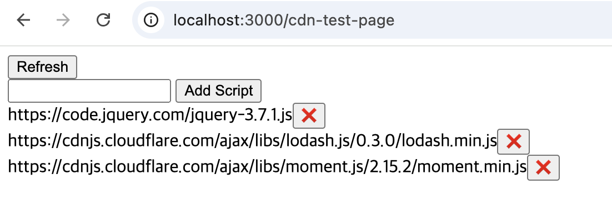

## Build Bundles

```
cd build-bundles
```

```
npm install
```

```
npm run build:all
```


## Run Script Test Page

```
npm start
```
or
```
npx serve
```

`http://localhost:3000/script-test-page`




- scripts from [cdnjs](https://cdnjs.com/)
- scripts from build-bundles/build (e.g. `/build-bundles/build/esbuild/out.js`)

